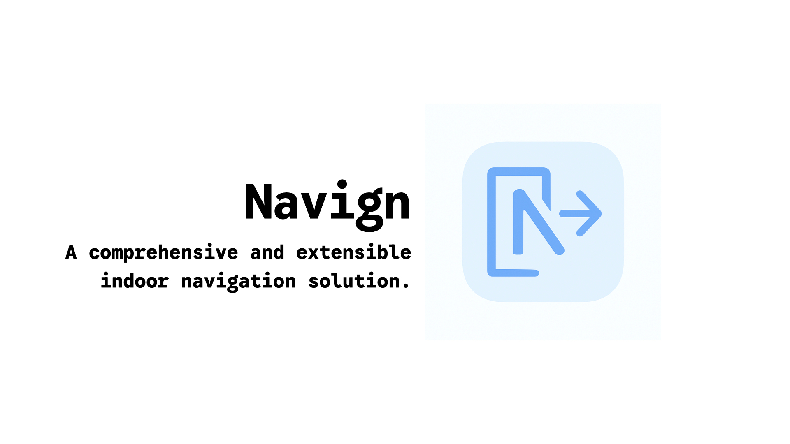

# Navign

The Navign project is a solution for indoor mall navigation, which not just limits to providing directions but also offers a comprehensive pipeline for mall management. It includes features for localize, navigate, unlock, or even provide a robot for dual purposes of navigation and delivery within the mall premises, particularly useful as a substitute for guide dogs for visually impaired individuals.

The whole system is in [this repository](https://github.com/indoor-mall-nav/navign). We have modularized the system into several components:

- Beacon: Responsible for indoor localization using Bluetooth beacons.
- Mobile: Tauri application for user interface and navigation.
- Robot: ROS-based robot for navigation and delivery tasks as well as Embassy-based control.
- Server: Server-side application for managing mall data and user requests.

We are also implementing the admin panel for mall management, but it is not yet available in this repository.

Since I am still a student in 12th grade, I may not have enough time to maintain this project regularly. However, I welcome contributions from the community to help improve and expand the project. Feel free to fork the repository, submit pull requests, or open issues for any bugs or feature requests.

This project is under the MIT License, but if you want to use it for commercial purposes, please contact me for further discussion. I can assist with customization and deployment services.

Made with ❤️ for a better indoor navigation experience, and you don't need to spend 30 minutes to find a boba tea shop anymore with Navign!